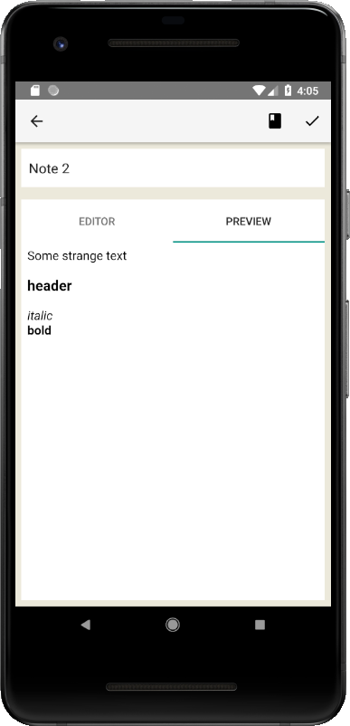

 

## Introduction

**Laverna Android** is a companion note-taking application for [Laverna](https://github.com/Laverna/laverna) (web app) designed for Android. It's built to help to become Laverna a full-blown open source alternative to _Evernote_.

The application supports Android 4.1 JELLY BEAN (API level 16) and above.

### Screenshot:

### Features include:
- An easy-to-use interface
- Markdown editor based on Pagedown (coming soon)
- Manage your notes, even when you're offline
- Secure client-side encryption (coming soon)
- Synchronizes with cloud storage services (coming soon)
- WYSIWYG control buttons (coming soon)
- Syntax highlighting (coming soon)
- No registration required
- Native Android app
- Gestures

## Installation

There are different ways to get the Laverna app for Android: through the google play, from github or building it yourself.

### Google play

Comming soon

### From GitHub
Download the .apk from https://github.com/vboitsov/laverna-android/releases

### Building

#### With Gradle

This project requires the [Android SDK](http://developer.android.com/sdk/index.html) to be installed in your development environment. In addition you'll need to set the `ANDROID_HOME` environment variable to the location of your SDK. For example:

`export ANDROID_HOME=/home/<user>/tools/android-sdk`

After satisfying those requirements, the build is pretty simple:

- Run `./gradlew build` from the within the project folder. It will build the project for you and install it to the connected Android device or running emulator.

#### With Android Studio

The easiest way to build is to install [Android Studio](https://developer.android.com/sdk/index.html) with Gradle. Once installed, then you can import the project into Android Studio:

1. Open `File`
2. Import Project
3. Select `build.gradle` under the project directory
4. Click `OK`

Then, Gradle will do everything for you.

## Support

- Hit star button on github
- Like Laverna on [alternativeto.net](http://alternativeto.net/software/laverna/)
- Contribute

## License

Laverna Android is free software; you can redistribute it and/or modify it under the terms of the Apache license, version 2.0. You may obtain a copy of the License at

`http://www.apache.org/licenses/LICENSE-2.0`

Unless required by applicable law or agreed to in writing, software distributed under the License is distributed on an "AS IS" BASIS, WITHOUT WARRANTIES OR CONDITIONS OF ANY KIND, either express or implied. See the License for the specific language governing permissions and limitations under the License.

